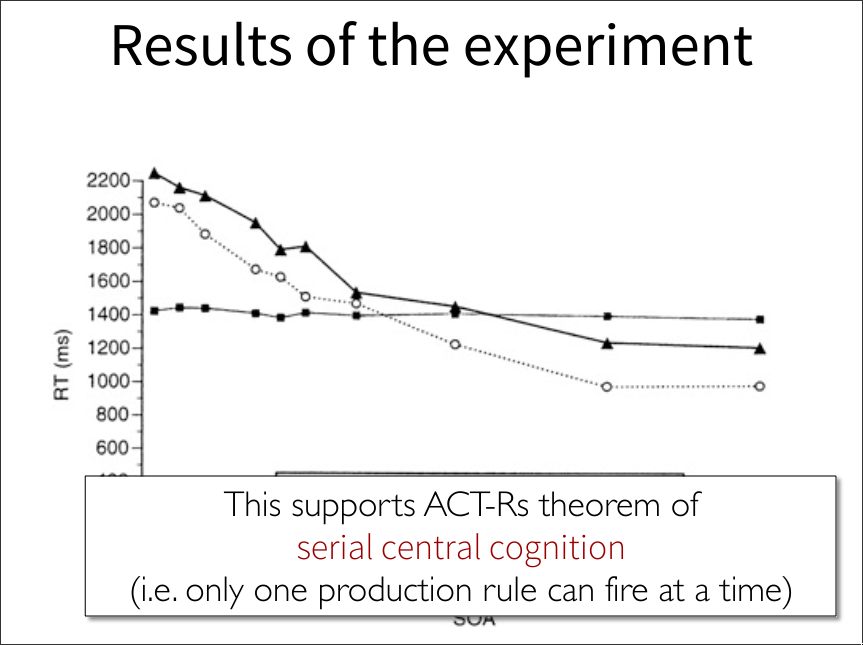

## Team 77
- Tobias Pucher (S5751659)
- Matthias Heiden (S5751616)

---

In a separate pdf file, show the output of your model, and answer the following questions:

## What is the effect of manipulating the parameters below on the pattern of the results? Explain the reason behind it. It is useful to think in advance what the effect might be, instead of just trying it out. Of course, it is still a good idea to also try it out.

- Retrieval Threshold, τ (:rt, typical values -1.0 to 2.0)
  - **Effect**: Retrieval fails less/more often. 
  - **Reason**: Determines if a chunk can be retrieved. The higher the threshold, the more likely it is that the retrieval fails (recall probability is decreases). When a retrieval request is made, then the chunk's activation is compared to the threshold. If the activation is higher than the threshold, then the retrieval is successful. The chunk with the highest activation is retrieved.
- Latency Factor, F (:lf, typical values range from .1 to 2) 
  - **Effect**: Retrieval takes longer/shorter.
  - **Reason**: The activation of a chunk also determines how long it takes to retrieve it. It's a linear multiplier. If the latency factor is increased, then the retrieval takes longer and vice versa.
    - Retrieval time: `RT = Fe^{−A}`
- Activation noise, s (:ans  range 0.1-0.8)
  - **Effect**: TODO: higher or lower?
  - **Reason**: Likelyhood of retrieving a chunk regardless of context.
  - Also known as: instantaneous noise (s), recomputed at each retrieval attempt.

## The model you constructed uses two strategies sequentially. First, it fires production rules that try to retrieve the answer from memory. If that retrieval fails, it fires production rules that calculate the answer through counting. This model is inspired by an older model from Gordon Logan. This original model executed both strategies (counting and retrieval) in parallel. That is, it attempted to retrieve the answer and, at the same time, it started to count. The final answer was provided by the strategy that finished first. Would it be possible to implement such a parallel strategy in ACT-R? If yes, what would such a model look like? If no, why is it not possible?

No, it's not possible to implement such a model.

The reasons for that are: 
- ACT-R assumes that the central production system is serial
  - Only one production rule can fire at a time
- There's serial and parallel processing in ACT-R:
  - Serial: 
    - Procedural module
      - One production at a time
    - Other modules
      - One request at a time
      - A single chunk in a buffer
  - Parallel: 
    - The modules operate in parallel
    - Internal mechanisms of a module can be highly parallel
      - Conflict resolution
      - Declarative retrievals
      - Finding a visual-location
- **Perceptual and motor modules** work in parallel, but a single module can only work on one thing at a time

## If you think about how the brain processes information, do you think it could do counting and retrieval in parallel? What would be requirement for this?

The brain's information processing is highly parallel, but has a bottleneck (see lecture 3). While it may be possible that the counting and retrieval is done in parallel, it's much more likely that it's not. 

Both the counting and retrieval are done in the **central cognitive system**, which is responsible for coordinating perception/action and "thinking". Experiments suggest that the central cognitive system is **serial**.

Based on the Psychological Refractory Period experiments from Lecture 3, it's likely that the counting and retrieval is done in **serial**.

There's no way to test this theory, because retrieval is very fast. However, one could change the experiment to make the retrieval slower or replace it with an equivalent but more complex task. In fact, this was done the in the previously mentioned experiment.

