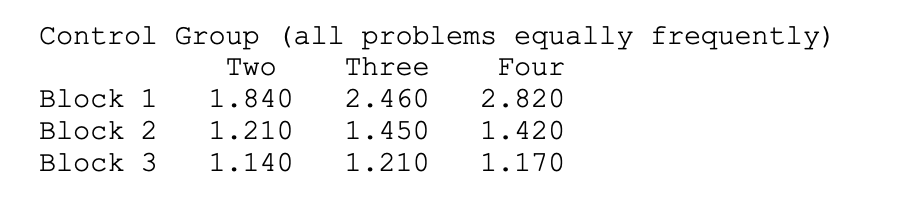

## Initial performance
The results after implementing the retrieval were as follows:

```
? (zbrodoff-compare 5)
...

CORRELATION:  0.971
MEAN DEVIATION:  0.673

              2 (64)      3 (64)      4 (64)
Block  1  1.224 (64)  1.366 (64)  1.393 (64)
Block  2  1.041 (64)  1.009 (64)  1.022 (64)
Block  3  0.999 (64)  1.006 (64)  1.026 (64)
NIL
? (actr-load "ACT-R:tutorial;lisp;zbrodoff.lisp")
? (zbrodoff-compare 1)
...

CORRELATION:  0.933
MEAN DEVIATION:  0.666

              2 (64)      3 (64)      4 (64)
Block  1  1.347 (64)  1.318 (64)  1.429 (64)
Block  2  1.001 (64)  1.027 (64)  1.004 (64)
Block  3  0.991 (64)  0.985 (64)  0.980 (64)
NIL
```

The human experiment which should be approximated gave the following results:



## Parameter tuning
- correlation is quite good already
- model is too fast overall -> high deviation

Parameters: latency factor, base-level decay rate, activation noise, and retrieval  threshold

`(sgp :v t :esc t :lf 0.4 :bll 0.5 :ans 0.5 :rt 0 :ncnar nil`

### Retrieval threshold
by adjusting the retreival threshold: `:rt 0.5`
```
CORRELATION:  0.957
MEAN DEVIATION:  0.434

              2 (64)      3 (64)      4 (64)
Block  1  1.360 (64)  1.558 (64)  2.232 (64)
Block  2  1.017 (64)  1.102 (64)  1.177 (64)
Block  3  1.026 (64)  0.996 (64)  0.991 (64)
```
 :rt 0.8

CORRELATION:  0.977
MEAN DEVIATION:  0.314

              2 (64)      3 (64)      4 (64)
Block  1  1.470 (64)  1.850 (64)  2.258 (64)
Block  2  1.150 (64)  1.422 (64)  1.375 (64)
Block  3  0.993 (64)  1.062 (64)  1.069 (64)
NIL


:rt 0.93

CORRELATION:  0.986
MEAN DEVIATION:  0.130

              2 (64)      3 (64)      4 (64)
Block  1  1.816 (64)  2.362 (64)  2.532 (64)
Block  2  1.118 (64)  1.320 (64)  1.544 (64)
Block  3  1.068 (64)  1.096 (64)  1.196 (64)
NIL

:rt 0.95

CORRELATION:  0.993
MEAN DEVIATION:  0.120

              2 (64)      3 (64)      4 (64)
Block  1  1.790 (64)  2.213 (64)  2.631 (64)
Block  2  1.207 (64)  1.296 (64)  1.479 (64)
Block  3  1.122 (64)  1.167 (64)  1.162 (64)
NIL

**-> rt=0.95**

a little higher response time in the first block but similar results in the last 2 blocks would be better.

?? I could not find a better solution even when adjusting the others, makes it only worse..
also the 0.12 is not very consistent..
