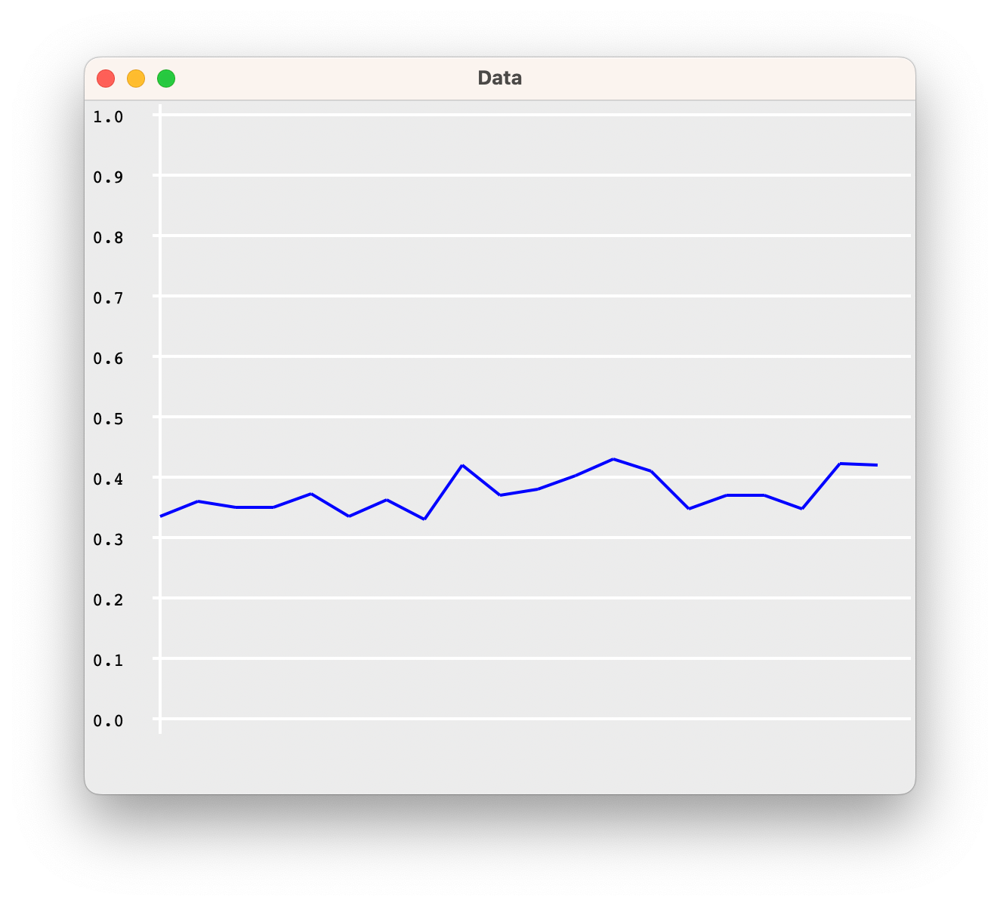

## Team 77
- Tobias Pucher (S5751659)
- Matthias Heiden (S5751616)

## Show the learning of your model in a graph

```lisp
? (onehit-learning 100)
((0.3524 0.3628 0.3928 0.3852)
 (0.334 0.35799998 0.348 0.35 0.372 0.334 0.362 0.32999998 0.41799998 0.37
  0.378 0.402 0.43 0.408 0.34600002 0.37 0.368 0.34600002 0.422 0.42))
```




## Describe which information you store in memory, and explain why. Why don't you store more or less information?

Information stored in memory:

- ostart: Opponent start sum
- mstart: My start sum
- action: Action taken

More information: Can't remember as many games. 
Less information: Can't remember the details needed to win the games.

We took the approach at how we would learn to get better at blackjack and the simplest solution we came up to was to look at our score and our opponents score and determine based on past experiences if it was likely or unlikely to win/lose/bust if we take a card or not. So the individual cards/number would not matter to us so we skipped out on that for the model as well. This can be illustrated by the following figure, as in the end its a statics problem:

Sweet spot: Bell curve


- Left: To little information saved, can't win games
- Right: To much information saved, can only remember a few games. Not enough to win on average.
- Middle: Sweet spot

## Explain why you need partial matching for this model; explain what would happen if you could not use partial matching.

Aadapt to variations and still trigger relevant productions based on the available information.

In simple terms this means that if we have seen a win/lose before with a certain starting sum on our side and a certain sum on the opponents side, but the opponents score is slightly different it should still have an impact that our own scores match and this "edge" in our should be remembered. Or similarly if our own scores differ from a past experience but the opponent has a certain already known sum its probable that the same action will be taken on their side and therefore has still some partially relevant information to the situation. 

Over time the partial matches. So its not necessary to have a perfect matching chunk to be able to retrieve an "advantage" from this chunk and we should therefore be able to retrieve and use it to achieve the goal. Also just thinking about the number of different possible combinations in blackjack and many other real-life situations, its not realistic to store all possible corresponding buffers in order to be good at a task in regards to novel data/combinations.

---

**Flexible Matching**: The exact state of the game may not always match the conditions specified in the production rules. Partial matching allows the system to adapt to variations and still trigger relevant productions based on the available information.

**Noise Tolerance:** In real-world scenarios, there can be noise or uncertainty in the input data. Partial matching allows the system to handle situations where not all information is precise or complete. 

**Incremental Learning**: As the model interacts with the environment and learns from experience, it may encounter new states or variations in the input. Partial matching enables the model to generalize the learned knowledge to similar situations.

## Partial matching is calculated across the slots in your retrieval request. What is the effect of specifying more slots in your request as compared to fewer?

Adding more slots to a retrieval request **makes the query more specific**. This means the system will look for chunks that match a greater number of criteria, narrowing down the pool of potential matches.

With more slots specified, the likelihood of finding chunks that match all the criteria decreases. This can lead to fewer potential matches being retrieved, which might be beneficial for precision but could also miss relevant but less obvious matches.

In regards to the fan-effect, this means that there is a smaller fan because less chunks share the same value for each slot. The more slots, the more specific the associative strength calculation becomes, potentially reducing the fan-effect by filtering out less relevant chunks. However if many chunks match all slots than the fan-effect can still slow down retrieval.

With fewer slots in the retrieval request, the query is more general. This allows for a broader range of chunks to be considered as potential matches.

## Discuss whether this is a plausible model of playing black jack, and why/why not.

It is a plausible model from our perspective, because we modeled the model after how we would learn to get better at blackjack given the provided hand/game information.

We did not hard code any specific numbers or rules and its all probability, which is the "intuition" we would have when playing blackjack as well. So a gut feeling that is expressed through the partial matching on the remembered chunks of past hands. As an example, our model is general enough to work on a different kind of blackjack with lets say a card range of 1-100 instead of 1-11 and a upper limit of 169 instead of 21. Again, because it simply models our thought process of learning blackjack without studying cards or counting cards or similar things which most people will not do for the goal of getting better.

