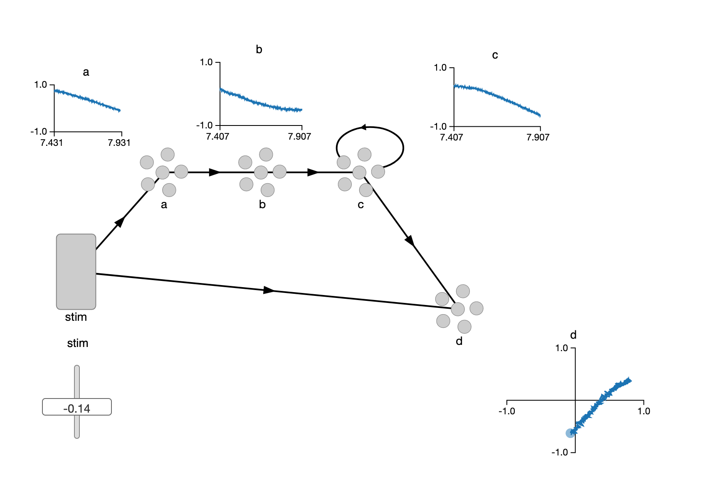
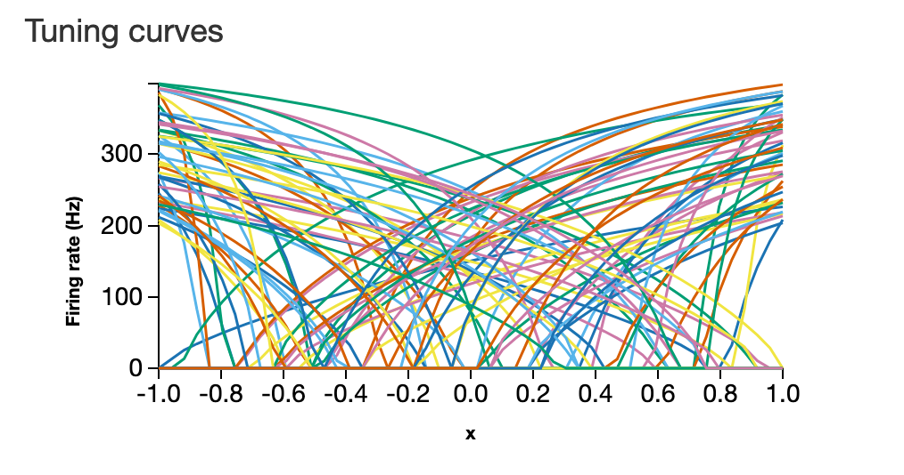
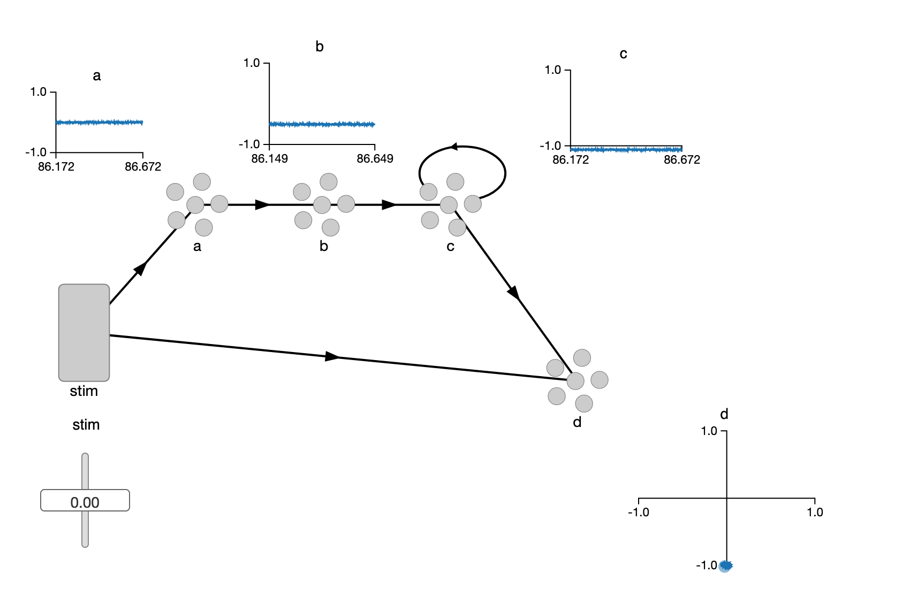

## Team 77
- Tobias Pucher (S5751659)
- Matthias Heiden (S5751616)

# Report

## A screenshot in which you show values (right click, Value) for ensembles a, b, and c, and a two-dimensional value for ensemble d (XY-value) while running your model, demonstrating the effects of the various connections that you made.

## A screenshot of the tuning curves of ensemble a (right click on a, Details…, Plots). Explain what those tuning curves indicate.

A tuning curve shows for a spiking neuron the activation voltage inside the neuron needed for it to spike with a certain frequency. In the case of the "on-neuron"s this curve has a constant value of 0Hz until the activation threshold is reaching and the curve starts to increase in value indicating the firing frequency at that voltage. It can be both negative and postive for both "on" and "off" neurons. In the case of "off" neurons its not an activation threshold but rather a stop threshold for it to stop firing. The activation curve is based on the fundamental knowledge (simplified) about biological neurons and their spiking behaviour.

## Set the stimulus to 0 (right-click on the stimulus, 'Set value...' – it will ignore the sine function) . Explain the pattern that you see in the value displays of a, b, and c. 

As seen in the following screenshot the values of the ensambles a,b and c all stay at fixed points. The input of 0 to ens A gets transimtted as is. The output of a is therefore also 0. The output of B on the other hand is some negative value of around -0.5. This is due to the connection defined with our custom square function that results in the value of $0 \times 0 -0.5 = -0.5 [V]$. The ens. C seems to be outputting the maximum negative value of $-1[V]$. This is due to the cycle of C to itself. Because the activation threshold lies above the -0.5 the ens. C does not increase the value it outputs the same value again. This cycle is self-feeding a negative value each time-step and is therefore decreasing the value until no further decrease is possible.

Screenshot:

