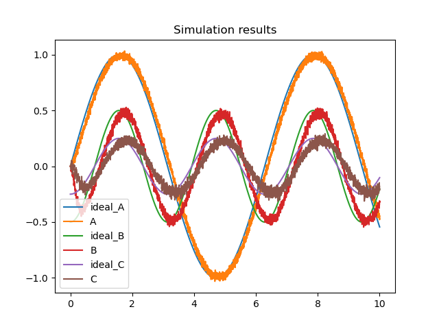

## Graph with the ideal and actual signals in ensemble C.



The output looks of C looks correct, because it's exactly half the value of B (which we specified in the transform function). It also closely resembles the line of ideal_C.

## an explanation of the functions compute_tuning_curves, compute_response, and run_neurons at a conceptual level. That is, explain in your own words what the inputs and outputs of those functions are, and how they are computed. You do not have to explain gain and bias, these are properties of the neurons, defining their exact responses to input.

### compute_tuning_curves

**Overview**: Calculates the tuning curves for a population of neurons (=ensemble). Tuning curves represent how the firing rate of each neuron in a population changes in response to different input values. This can be done by iterating over a set of input values and computing the neural response to each input.

**Input**: The input is a set of encoders, gains and biases. They are just passed to the `compute_response` function. 

**Output**: Returns a list of x_values (used for computing the tuning curves) and a matrix of neural responses to each input (=tuning curves).

---

```python
def compute_tuning_curves(encoder, gain, bias):
    """Compute the tuning curves for a population"""
    # generate a set of x values to sample at
    x_values = [i * 2.0 / N_samples - 1.0 for i in range(N_samples)]

    # build up a matrix of neural responses to each input (i.e. tuning curves)
    A = []
    for x in x_values:
        response = compute_response(x, encoder, gain, bias)
        A.append(response)
    return x_values, A
```

### compute_response

**Overview**: Models the response of a neural population to a input value. It simulates the behavior of neurons over time, considering factors like membrane voltage and refractory periods.

**Input**: The input is a single value x, a set of encoders, gains and biases. They are just passed to the `run_neurons` function.

**Output**: Returns a list of spike rates (in Hz) for each neuron in the population (=frequency of spikes).

---

```python
def compute_response(x, encoder, gain, bias, time_limit=0.5):
    """Measure the spike rate of a population for a given value x."""
    N = len(encoder)  # number of neurons
    v = [0] * N  # voltage
    ref = [0] * N  # refractory period

    # compute input corresponding to x
    input = []
    for i in range(N):
        input.append(x * encoder[i] * gain[i] + bias[i])
        v[i] = np.random.uniform(0, 1)  # randomize the initial voltage level

    count = [0] * N  # spike count for each neuron

    # feed the input into the population for a given amount of time
    t = 0
    while t < time_limit:
        spikes = run_neurons(input, v, ref)
        for i, s in enumerate(spikes):
            if s:
                count[i] += 1
        t += dt
    return [c / time_limit for c in count]  # return the spike rate (in Hz)
```

### run_neurons

**Overview**: This function implements a simple leaky integrate-and-fire neuron model, used to simulate the behavior of neurons over time. 
- Prevents neurons from firing immediately after a spike (refractory period)
- Updates the membrane voltage of each neuron based on the input
- Determines whether a neuron spikes or not based on its membrane voltage

**Input**: This function gets for each neuron: the input currents, membrane voltage and refractory period.

**Output**: Returns a list of booleans, indicating whether a neuron spiked or not.

---

```python
def run_neurons(input, v, ref):
    """Run the neuron model.

    A simple leaky integrate-and-fire model, scaled so that v=0 is resting
    voltage and v=1 is the firing threshold.
    """
    spikes = []
    for i, _ in enumerate(v):
        dV = dt * (input[i] - v[i]) / t_rc  # the LIF voltage change equation
        v[i] += dV
        if v[i] < 0:
            v[i] = 0  # don't allow voltage to go below 0

        if ref[i] > 0:  # if we are in our refractory period
            v[i] = 0  # keep voltage at zero and
            ref[i] -= dt  # decrease the refractory period

        if v[i] > 1:  # if we have hit threshold
            spikes.append(True)  # spike
            v[i] = 0  # reset the voltage
            ref[i] = t_ref  # and set the refractory period
        else:
            spikes.append(False)
    return spikes
```